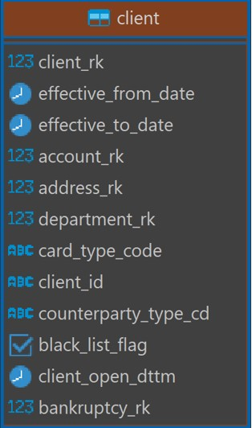

#  Задание 2
В имеющихся витринах есть дефекты. Для того, чтобы заказчик был доволен и мог беспрепятственно ипользовать их, необходимо оперативно устранить дефекты.

Загрузить DATABASE_DUMP.sql:
- создать слой dwh в postgres
- psql -U ats -d banking-etl-db -f DATABASE_DUMP.sql
## **Задание 2.1**

Имеется витрина dm.client, в которой содержится различная информация по клиентам банка. Заказчик сообщил, что в таблице имеются дубли, которые нужно устранить.

Необходимо подготовить запрос, по которому можно обнаружить все дубли в витрине и удалить их.

Схема витрины:
У данной таблицы имеется составной ключ, который состоит из двух полей, по которым можно выявить уникальную строку:
- client_rk – уникальный код клиента
- effective_from_date – дата начала действия записи

client_rk int8
effective_from_date date
effective_to_date date
account_rk int8
address_rk int8
department_rk int8
card_type_code text
client_id text
counterparty_type_cd text
black_list_flag bool
client_open_dttm timestamp
bankruptcy_rk int8
---
- ищем дубликаты по  client_rk,  effective_from_date
- удаляем те, где effective_to_date закончилось, либо если одинаковые - удалять любую строку
## **Задание 2.2**
Имеется витрина dm.loan_holiday_info, которая содержит информацию по кредитным каникулам, сделке и продукте, который был предоставлен клиенту в рамках сделки. После проверки качества данных выявилась проблема отсутствия некоторого количества записей в источниках витрины для некоторых периодов эффективности строк.

Источниками для данной витрины являются 3 таблицы:
- rd.deal – информация по сделкам клиентов
- rd.loan_holiday – информация о кредитных каникулах: дата начала, конца, тип кредитных каникул
- rd.product – информация о продуктах банка, которые он предоставляет

При формировании витрины был подготовлен прототип витрины, по которому она собирается, **loan_holiday_info_prototype.sql.**

Также, источник, из которого были загружены данные сущности на слой rd, предоставил актуальные выгрузки имеющихся у них данных в формате **csv**.

Необходимо проанализировать витрину, актуальное состояние таблиц-источников витрины и определить, по каким датам эффективности (effective_from_date или effective_to_date) отсутствуют строки и определить, какой способ загрузки новых данных подойдет: полная перегрузка таблицы или загрузка части данных.

Для загрузки данных на слой RD необходимо воспользоваться аналогичным методом загрузки данных из CSV файла в БД, которым Вы пользовались в первом задании. После того, как данные будут успешно загружены, необходимо написать процедуру, которая будет повторять шаги из прототипа для выполнения перегрузки данных в витрину.
## **Задание 2.3**
Имеется витрина dm.account_balance_turnover, которая отражает изменение баланса счетов по дням. Заказчик очень требователен в части заполнения всех полей этой витрины, например суммы на начало и конец дня, наименование валюты. Во время проверки качества данных обнаружили, что у счетов иногда отличается account_out_sum - сумма на конец одного дня и account_in_sum - сумма на начало следующего.

Витрина dm.account_balance_turnover строится на основе 3 источников:
- rd.account – информация по счетам клиентов
- rd.account_balance – информация с номер счета клиента и суммами на начало и конец дня
- dm.dict_currency – справочник валют

Для витрина имеется прототип account_balance_turnover_prototype.sql.

Необходимо:

1)    Подготовить запрос, который определит корректное значение поля account_in_sum. Если значения полей account_in_sum одного дня и account_out_sum предыдущего дня отличаются, то корректным выбирается значение account_out_sum предыдущего дня.
2)    Подготовить такой же запрос, только проблема теперь в том, что account_in_sum одного дня правильная, а account_out_sum предыдущего дня некорректна. Это означает, что если эти значения отличаются, то корректным значением для account_out_sum предыдущего дня выбирается значение account_in_sum текущего дня.
3)    Подготовить запрос, который поправит данные в таблице rd.account_balance используя уже имеющийся запрос из п.1
4)    Написать процедуру по аналогии с задание 2.2 для перезагрузки данных в витрину

В случае, если у Вас возникают какие-то трудности по части данных, необходимо обратиться к аналитику, которые оказывает Вам помощь в устранении данных дефектов (Ваш куратор)